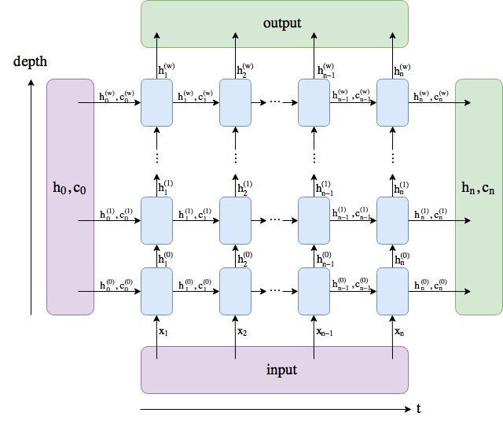

## Cookbook for neural network

### LSTM

The graph from [stack overflow](https://stackoverflow.com/questions/48302810/whats-the-difference-between-hidden-and-output-in-pytorch-lstm) explicitely illustrate the stucture of LSTM(without batch_size). 

In pytorch, [nn.LSTM](https://pytorch.org/docs/stable/nn.html?highlight=lstm#torch.nn.LSTM) could be used to build LSTM layer as follows:

```python
import torch
import torch.nn as nn

embed_dim = 32 # x_i dimention
hidden_dim = 16 # h_i dimention
num_layers = 2 # depth
batch_size = 5
seq_len = 10 # length of sequence, n in the graph
vocab_size = 100 # 100 words in vocabulary

input = torch.randint(0, vocab_size, size=(batch_size, seq_len)) # batch_size sequences(each seq len is seq_len)
print('input shape: ', input.shape) # batch_size * seq_len

# the padding word index is 0
embedding = nn.Embedding(vocab_size, embed_dim, padding_idx=0)
emb_output = embedding(input)
print('embedding shape: ', emb_output.shape) # batch_size * seq_len * embed_dim

# batch_first=True, the first dimension of input is batch_size
lstm = nn.LSTM(embed_dim, hidden_dim, num_layers, batch_first=True)
output, (h_n, c_n) = lstm(emb_output)
print('lstm output: ', output.shape) # batch_size * seq_len * hidden_dim
print('lstm last hidden output: ', h_n.shape) # num_layers * batch_size * hidden_dim
print('lstm last cell state: ', c_n.shape) # num_layers * batch_size * hidden_dim
print('last(t) output in lstm output is equal to last(depth/layer) in h_n')
print(output[0][-1] == h_n[-1][0])
```




